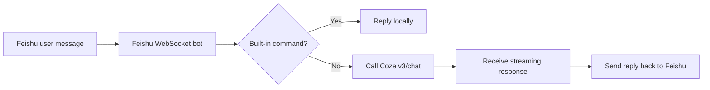

# Feishu-Coze Bridge Bot

一个长期在线的飞书机器人服务：接收飞书消息，把普通文本转发给 Coze 智能体，再把回复发回飞书。

This project is a practical bridge between Feishu and Coze. It keeps a Feishu bot online over the official WebSocket channel, routes normal text messages to a Coze bot, and sends the final reply back to Feishu.

## What It Solves

- Keep a Feishu bot online without building a full web callback service
- Forward normal text messages from Feishu to a Coze bot
- Preserve separate Coze conversations for different Feishu users and chats
- Keep a few local debug artifacts so issues are easier to trace
- Provide Windows helper scripts for start, stop, and status checks

## Message Flow



## Features

- Official Feishu WebSocket event channel
- Private chat auto-reply
- Group reply only when the bot is mentioned
- Built-in commands: `help`, `ping`, `status`, `id`, `echo ...`
- Coze `v3/chat` streaming integration
- Per-chat Coze conversation persistence
- Local runtime logs under `runtime/`

## Quick Start

1. Copy `.env.example` to `.env`
2. Fill in your Feishu and Coze credentials
3. Install dependencies
4. Start the bot service

```powershell
python -m pip install -r requirements.txt
python -m bot_service.service
```

## Environment Variables

| Variable | Required | Description |
| --- | --- | --- |
| `FEISHU_APP_ID` | Yes | Feishu app ID |
| `FEISHU_APP_SECRET` | Yes | Feishu app secret |
| `COZE_API_BASE_URL` | No | Defaults to `https://api.coze.cn` |
| `COZE_BOT_ID` | No | Target Coze bot ID |
| `COZE_ACCESS_TOKEN` | No | Coze personal access token |
| `COZE_TIMEOUT_SECONDS` | No | Request timeout, default `120` |

If `COZE_BOT_ID` and `COZE_ACCESS_TOKEN` are missing, the service falls back to local starter replies instead of forwarding to Coze.

## Built-In Commands

| Command | Behavior |
| --- | --- |
| `help` | Show supported commands |
| `ping` | Quick health check |
| `status` | Show service status |
| `id` | Show chat and sender identifiers |
| `echo anything` | Echo the message tail |

Any other plain-text message is treated as normal bot input and can be forwarded to Coze.

## Project Structure

- `bot_service/config.py`: reads `.env` and normalizes runtime settings
- `bot_service/feishu_api.py`: Feishu token and message helpers
- `bot_service/coze_api.py`: Coze `v3/chat` streaming client and conversation storage
- `bot_service/logic.py`: command handling and reply routing
- `bot_service/service.py`: WebSocket entrypoint

## Windows Helpers

This repo includes helper launchers for machines that prefer `.cmd` entrypoints:

- `start_bot.cmd`
- `stop_bot.cmd`
- `status_bot.cmd`

They call the matching PowerShell scripts with execution policy bypass.

## Reusable Local Skill

This workspace also includes a reusable local skill bundle for future Feishu + Coze bridge work:

- `skills/feishu-coze-bridge-ops/SKILL.md`
- `skills/feishu-coze-bridge-ops/references/current-setup.md`
- `skills/feishu-coze-bridge-ops/references/publish-and-verify.md`

## Operations Notes

- `runtime/` stores logs, raw events, and Coze conversation mappings
- The bot ignores its own outbound messages to avoid loops
- Group chats only auto-reply when the bot is explicitly mentioned
- The service assumes your Feishu app is already configured for WebSocket event delivery

## Security Notes

- Never publish `.env`
- Keep `.env.example` as placeholders only
- Treat `runtime/` as local debug state, not source code
- Replace `COZE_BOT_ID` and `COZE_ACCESS_TOKEN` with your own values before running

## Always-On Options

This repo gives you the bot service itself, but not OS-level auto-start. Common next steps are:

- run it inside a persistent terminal session
- use Task Scheduler to start it on login
- wrap it with a Windows service manager later

## License

MIT
